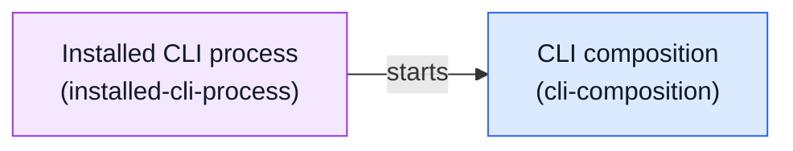

<!-- Generated by architecture-chain-modeler; DO NOT EDIT. -->

# Deployment and runtime

## Legend

- **Module**
- **Runtime/deployment unit**

## Evidence

| Item | Repository evidence | Confidence |
| --- | --- | --- |
| `installed-process-starts-cli` | `package.json#bin` | **confirmed** |
| `installed-process-starts-cli` | `src/cli.ts#run` | **confirmed** |
| `cli-composition` | `docs/ARCHITECTURE.md` | **confirmed** |
| `cli-composition` | `src/cli.ts#run` | **confirmed** |
| `cli-composition` | `src/cli-runtime.ts#createDefaultDependencies` | **confirmed** |
| `cli-composition` | `src/cli-runtime.ts#createDefaultService` | **confirmed** |
| `installed-cli-process` | `package.json#bin` | **confirmed** |
| `installed-cli-process` | `src/cli.ts#run` | **confirmed** |
| `installed-cli-process` | `src/cli-runtime.ts#createBackgroundWorkerRuntime` | **confirmed** |
| `installed-cli-process` | `scripts/verify-native-release-package.mjs` | **confirmed** |
