<!-- Generated by architecture-chain-modeler; DO NOT EDIT. -->

# Agent turn

```mermaid
flowchart LR
    n_6167656e742d7475726e_s0["CLI composition: Dispatch a prompt or resume command and compose native dependencies."]
    n_6167656e742d7475726e_s1["TUI adapter: Submit the user turn and present runtime state and decisions."]
    n_6167656e742d7475726e_s0 --> n_6167656e742d7475726e_s1
    n_6167656e742d7475726e_s2["Session application: Register the turn, prepare context, and own one terminal settlement."]
    n_6167656e742d7475726e_s1 --> n_6167656e742d7475726e_s2
    n_6167656e742d7475726e_s3["Core runtime: Run provider-neutral model and tool rounds."]
    n_6167656e742d7475726e_s2 --> n_6167656e742d7475726e_s3
    n_6167656e742d7475726e_s4["Provider gateway: Stream the selected provider route and normalize accepted events."]
    n_6167656e742d7475726e_s3 --> n_6167656e742d7475726e_s4
    n_6167656e742d7475726e_s5["Model provider APIs: Return protocol output or an error; failures before accepted events bypass Transcript append."]
    n_6167656e742d7475726e_s4 --> n_6167656e742d7475726e_s5
    n_6167656e742d7475726e_s6["Native persistence: Conditionally persist accepted assistant and tool events before projection."]
    n_6167656e742d7475726e_s5 --> n_6167656e742d7475726e_s6
    n_6167656e742d7475726e_s7["Native Transcript JSONL: Append authoritative assistant/tool records only when accepted events exist, preserving native order."]
    n_6167656e742d7475726e_s6 --> n_6167656e742d7475726e_s7
    n_6167656e742d7475726e_s8["Session application: After any required durable persistence and cleanup, settle completion, cancellation, or failure exactly once without replaying accepted provider or tool side effects."]
    n_6167656e742d7475726e_s7 --> n_6167656e742d7475726e_s8
    n_6167656e742d7475726e_s9["TUI adapter: Present the terminal state and resulting conversation."]
    n_6167656e742d7475726e_s8 --> n_6167656e742d7475726e_s9
```

## Evidence

| Item | Repository evidence | Confidence |
| --- | --- | --- |
| `agent-turn` | `src/application/session-service.ts#ClaudeSessionService` | **confirmed** |
| `agent-turn` | `src/application/turn-lifecycle.ts#TurnCoordinator` | **confirmed** |
| `agent-turn` | `src/core/runtime.ts#AgentRuntime` | **confirmed** |
| `agent-turn` | `src/cli/interactive.tsx#InteractiveApp` | **confirmed** |
| `agent-turn` | `src/persistence/native-transcript-store.ts#NativeTranscriptStore` | **confirmed** |
