<!-- Generated by architecture-chain-modeler; DO NOT EDIT. -->

# Installed package startup

```mermaid
flowchart LR
    n_696e7374616c6c65642d7061636b6167652d73746172747570_s0["CLI composition: Load the installed npm bin and dispatch dist/cli.js."]
    n_696e7374616c6c65642d7061636b6167652d73746172747570_s1["CLI composition: Handle version or help without eagerly requiring a provider."]
    n_696e7374616c6c65642d7061636b6167652d73746172747570_s0 --> n_696e7374616c6c65642d7061636b6167652d73746172747570_s1
    n_696e7374616c6c65642d7061636b6167652d73746172747570_s2["Native persistence: Resolve native paths for session listing and state access."]
    n_696e7374616c6c65642d7061636b6167652d73746172747570_s1 --> n_696e7374616c6c65642d7061636b6167652d73746172747570_s2
    n_696e7374616c6c65642d7061636b6167652d73746172747570_s3["Session application: List or resume sessions using only native data-plane records."]
    n_696e7374616c6c65642d7061636b6167652d73746172747570_s2 --> n_696e7374616c6c65642d7061636b6167652d73746172747570_s3
    n_696e7374616c6c65642d7061636b6167652d73746172747570_s4["CLI composition: Complete the package probe with no source-tree or package-local .git dependency."]
    n_696e7374616c6c65642d7061636b6167652d73746172747570_s3 --> n_696e7374616c6c65642d7061636b6167652d73746172747570_s4
```

## Evidence

| Item | Repository evidence | Confidence |
| --- | --- | --- |
| `installed-package-startup` | `package.json#bin` | **confirmed** |
| `installed-package-startup` | `src/cli.ts#run` | **confirmed** |
| `installed-package-startup` | `src/cli-runtime.ts#createDefaultService` | **confirmed** |
| `installed-package-startup` | `src/persistence/data-plane.ts#resolveDataPlanePaths` | **confirmed** |
| `installed-package-startup` | `scripts/verify-native-release-package.mjs` | **confirmed** |
