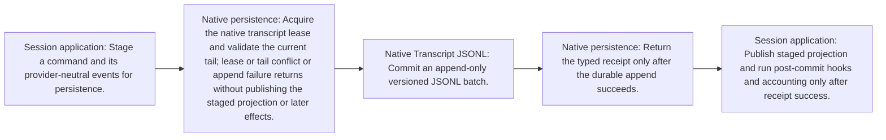

<!-- Generated by architecture-chain-modeler; DO NOT EDIT. -->

# Native persistence

## Evidence

| Item | Repository evidence | Confidence |
| --- | --- | --- |
| `native-persistence-flow` | `src/application/turn-persistence.ts#TurnPersistence` | **confirmed** |
| `native-persistence-flow` | `src/persistence/native-transcript-store.ts#NativeTranscriptStore` | **confirmed** |
| `native-persistence-flow` | `src/persistence/native-transcript-codec.ts#createNativeTranscriptCodec` | **confirmed** |
