<!-- Generated by architecture-chain-modeler; DO NOT EDIT. -->

# Provider fallback

```mermaid
flowchart LR
    n_70726f76696465722d66616c6c6261636b_s0["Session application: Allocate a fresh turn-scoped provider stack."]
    n_70726f76696465722d66616c6c6261636b_s1["Provider gateway: Buffer the primary attempt before committing output or route state."]
    n_70726f76696465722d66616c6c6261636b_s0 --> n_70726f76696465722d66616c6c6261636b_s1
    n_70726f76696465722d66616c6c6261636b_s2["Model provider APIs: Return an error before any buffered events are accepted; buffered partial output remains private to the provider gateway."]
    n_70726f76696465722d66616c6c6261636b_s1 --> n_70726f76696465722d66616c6c6261636b_s2
    n_70726f76696465722d66616c6c6261636b_s3["Provider gateway: Classify the buffered result before continuation; incompatible, nonretryable, or otherwise ineligible failures fail closed without exposing buffered partial events."]
    n_70726f76696465722d66616c6c6261636b_s2 --> n_70726f76696465722d66616c6c6261636b_s3
    n_70726f76696465722d66616c6c6261636b_s4["Provider gateway: For an eligible failure, retry through the declared fallback or explicitly eligible non-streaming route."]
    n_70726f76696465722d66616c6c6261636b_s3 --> n_70726f76696465722d66616c6c6261636b_s4
    n_70726f76696465722d66616c6c6261636b_s5["Model provider APIs: Return the fallback protocol result or error to the provider gateway."]
    n_70726f76696465722d66616c6c6261636b_s4 --> n_70726f76696465722d66616c6c6261636b_s5
    n_70726f76696465722d66616c6c6261636b_s6["Provider gateway: Obtain one successful complete result and seal the route for subsequent continuations."]
    n_70726f76696465722d66616c6c6261636b_s5 --> n_70726f76696465722d66616c6c6261636b_s6
    n_70726f76696465722d66616c6c6261636b_s7["Core runtime: Receive only the accepted provider-neutral events after route sealing."]
    n_70726f76696465722d66616c6c6261636b_s6 --> n_70726f76696465722d66616c6c6261636b_s7
```

## Evidence

| Item | Repository evidence | Confidence |
| --- | --- | --- |
| `provider-fallback` | `src/providers/fallback-provider.ts#FallbackModelProvider` | **confirmed** |
| `provider-fallback` | `src/providers/non-streaming-fallback-provider.ts#NonStreamingFallbackModelProvider` | **confirmed** |
| `provider-fallback` | `src/providers/provider-registry.ts#resolveProviderRegistry` | **confirmed** |
| `provider-fallback` | `docs/ARCHITECTURE.md` | **confirmed** |
