<!-- Generated by architecture-chain-modeler; DO NOT EDIT. -->

# Tool admission and settlement

```mermaid
flowchart LR
    n_746f6f6c2d61646d697373696f6e2d616e642d736574746c656d656e74_s0["Core runtime: Validate and schedule a process-backed model tool call."]
    n_746f6f6c2d61646d697373696f6e2d616e642d736574746c656d656e74_s1["Integration adapters: Run configured PreToolUse integration checks."]
    n_746f6f6c2d61646d697373696f6e2d616e642d736574746c656d656e74_s0 --> n_746f6f6c2d61646d697373696f6e2d616e642d736574746c656d656e74_s1
    n_746f6f6c2d61646d697373696f6e2d616e642d736574746c656d656e74_s2["Tool security runtime: Resolve permission and sandbox admission; malformed or denied calls fail closed without execution, otherwise admit the process-backed call under permission and sandbox policy."]
    n_746f6f6c2d61646d697373696f6e2d616e642d736574746c656d656e74_s1 --> n_746f6f6c2d61646d697373696f6e2d616e642d736574746c656d656e74_s2
    n_746f6f6c2d61646d697373696f6e2d616e642d736574746c656d656e74_s3["Local execution and integration boundary: Execute only the admitted process-backed call."]
    n_746f6f6c2d61646d697373696f6e2d616e642d736574746c656d656e74_s2 --> n_746f6f6c2d61646d697373696f6e2d616e642d736574746c656d656e74_s3
    n_746f6f6c2d61646d697373696f6e2d616e642d736574746c656d656e74_s4["Project workspace: Receive the admitted command effects when the command mutates workspace files."]
    n_746f6f6c2d61646d697373696f6e2d616e642d736574746c656d656e74_s3 --> n_746f6f6c2d61646d697373696f6e2d616e642d736574746c656d656e74_s4
    n_746f6f6c2d61646d697373696f6e2d616e642d736574746c656d656e74_s5["Native persistence: Settle native tool-start and tool-completion records."]
    n_746f6f6c2d61646d697373696f6e2d616e642d736574746c656d656e74_s4 --> n_746f6f6c2d61646d697373696f6e2d616e642d736574746c656d656e74_s5
    n_746f6f6c2d61646d697373696f6e2d616e642d736574746c656d656e74_s6["Core runtime: Continue the agent loop from the settled result."]
    n_746f6f6c2d61646d697373696f6e2d616e642d736574746c656d656e74_s5 --> n_746f6f6c2d61646d697373696f6e2d616e642d736574746c656d656e74_s6
```

## Evidence

| Item | Repository evidence | Confidence |
| --- | --- | --- |
| `tool-admission-and-settlement` | `src/core/tool-execution-scheduler.ts#ToolExecutionScheduler` | **confirmed** |
| `tool-admission-and-settlement` | `src/permissions/claude-permission-resolver.ts#ClaudePermissionResolver` | **confirmed** |
| `tool-admission-and-settlement` | `src/sandbox/claude-sandbox-runtime.ts#ClaudeSandboxRuntime` | **confirmed** |
| `tool-admission-and-settlement` | `src/platform/bounded-process-runner.ts#BoundedProcessRunner` | **confirmed** |
| `tool-admission-and-settlement` | `src/hooks/claude-hooks.ts#ClaudeHookRunner` | **confirmed** |
