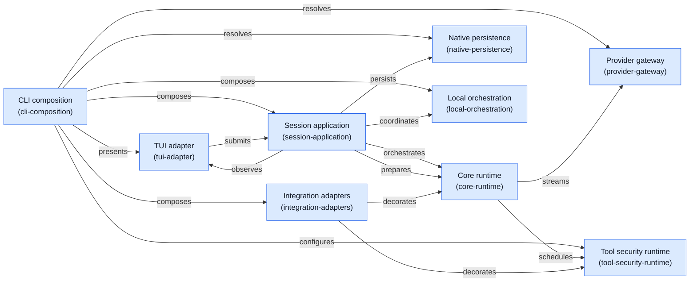

<!-- Generated by architecture-chain-modeler; DO NOT EDIT. -->

# Module relations

## Evidence

| Item | Repository evidence | Confidence |
| --- | --- | --- |
| `cli-presents-through-tui` | `src/cli-runtime.ts#createDefaultDependencies` | **confirmed** |
| `cli-presents-through-tui` | `src/cli/interactive.tsx#runInteractive` | **confirmed** |
| `cli-composes-session` | `src/cli-runtime.ts#createDefaultService` | **confirmed** |
| `cli-configures-tool-security` | `src/cli-runtime.ts#defaultPluginEvalRuntimeFactory` | **confirmed** |
| `cli-configures-tool-security` | `src/evals/eval-tool-admission.ts#isEvalToolCallPreapproved` | **confirmed** |
| `cli-resolves-provider` | `src/cli-runtime.ts#createDefaultService` | **confirmed** |
| `cli-resolves-provider` | `src/providers/provider-registry.ts#resolveProviderRegistry` | **confirmed** |
| `cli-composes-integrations` | `src/cli-runtime.ts#createDefaultService` | **confirmed** |
| `cli-composes-integrations` | `src/security/workspace-trust.ts#assessWorkspaceTrust` | **confirmed** |
| `cli-composes-orchestration` | `src/cli-runtime.ts#createDefaultDependencies` | **confirmed** |
| `cli-composes-orchestration` | `src/cli-runtime.ts#createBackgroundWorkerRuntime` | **confirmed** |
| `cli-resolves-native-storage` | `src/persistence/data-plane.ts#resolveDataPlaneRoot` | **confirmed** |
| `cli-resolves-native-storage` | `src/cli-runtime.ts#createDefaultDependencies` | **confirmed** |
| `tui-submits-session` | `src/cli/interactive.tsx#InteractiveApp` | **confirmed** |
| `tui-submits-session` | `src/application/session-service.ts#ClaudeSessionService` | **confirmed** |
| `tui-observes-session` | `src/cli/interactive.tsx#InteractiveApp` | **confirmed** |
| `tui-observes-session` | `src/application/session-service.ts#ClaudeSessionService` | **confirmed** |
| `session-orchestrates-core` | `src/application/session-service.ts#ClaudeSessionService` | **confirmed** |
| `session-orchestrates-core` | `src/core/runtime.ts#AgentRuntime` | **confirmed** |
| `session-prepares-context` | `src/application/context-preparation.ts#ContextPreparation` | **confirmed** |
| `session-prepares-context` | `src/application/session-service.ts#ClaudeSessionService` | **confirmed** |
| `session-persists-events` | `src/application/turn-persistence.ts#TurnPersistence` | **confirmed** |
| `session-persists-events` | `src/application/session-service.ts#ClaudeSessionService` | **confirmed** |
| `session-coordinates-local-orchestration` | `src/application/session-service.ts#ClaudeSessionService` | **confirmed** |
| `session-coordinates-local-orchestration` | `src/application/subagent-service.ts#ClaudeSubagentExecutor` | **confirmed** |
| `core-streams-provider` | `src/core/runtime.ts#ModelProvider` | **confirmed** |
| `core-streams-provider` | `src/providers/provider-registry.ts#NativeProviderRegistry` | **confirmed** |
| `core-schedules-tools` | `src/core/tool-execution-scheduler.ts#ToolExecutionScheduler` | **confirmed** |
| `core-schedules-tools` | `src/core/runtime.ts#ToolRegistry` | **confirmed** |
| `integrations-decorate-core` | `src/hooks/claude-hooks.ts#ClaudeHookRunner` | **confirmed** |
| `integrations-decorate-core` | `src/mcp/claude-mcp-tools.ts#ClaudeMcpToolRegistry` | **confirmed** |
| `integrations-decorate-tools` | `src/hooks/claude-hooks.ts#ClaudeHookRunner` | **confirmed** |
| `integrations-decorate-tools` | `src/mcp/claude-mcp-tools.ts#ClaudeMcpToolRegistry` | **confirmed** |
| `cli-composition` | `docs/ARCHITECTURE.md` | **confirmed** |
| `cli-composition` | `src/cli.ts#run` | **confirmed** |
| `cli-composition` | `src/cli-runtime.ts#createDefaultDependencies` | **confirmed** |
| `cli-composition` | `src/cli-runtime.ts#createDefaultService` | **confirmed** |
| `cli-composition` | `src/evals/held-out-corpus.ts#loadHeldOutCorpus` | **confirmed** |
| `cli-composition` | `src/evals/held-out-qualification.ts#executeHeldOutQualificationCommand` | **confirmed** |
| `cli-composition` | `src/cli-runtime.ts#defaultPluginEvalRuntimeFactory` | **confirmed** |
| `tui-adapter` | `src/cli/interactive.tsx#InteractiveApp` | **confirmed** |
| `tui-adapter` | `src/cli/interactive.tsx#runInteractive` | **confirmed** |
| `tui-adapter` | `docs/ARCHITECTURE.md` | **confirmed** |
| `session-application` | `src/application/session-service.ts#ClaudeSessionService` | **confirmed** |
| `session-application` | `src/application/turn-lifecycle.ts#TurnCoordinator` | **confirmed** |
| `session-application` | `src/application/context-preparation.ts#ContextPreparation` | **confirmed** |
| `session-application` | `src/application/turn-persistence.ts#TurnPersistence` | **confirmed** |
| `session-application` | `src/application/turn-accounting.ts#TurnAccounting` | **confirmed** |
| `core-runtime` | `src/core/runtime.ts#ModelProvider` | **confirmed** |
| `core-runtime` | `src/core/runtime.ts#ToolRegistry` | **confirmed** |
| `core-runtime` | `src/core/runtime.ts#PermissionResolver` | **confirmed** |
| `core-runtime` | `src/core/runtime.ts#AgentRuntime` | **confirmed** |
| `core-runtime` | `src/core/tool-execution-scheduler.ts#ToolExecutionScheduler` | **confirmed** |
| `core-runtime` | `src/core/transcript-event.ts#TranscriptEvent` | **confirmed** |
| `tool-security-runtime` | `src/tools/local-tools.ts#LocalToolRegistry` | **confirmed** |
| `tool-security-runtime` | `src/permissions/claude-permission-resolver.ts#ClaudePermissionResolver` | **confirmed** |
| `tool-security-runtime` | `src/evals/eval-tool-admission.ts#isEvalToolCallPreapproved` | **confirmed** |
| `tool-security-runtime` | `src/sandbox/claude-sandbox-runtime.ts#ClaudeSandboxRuntime` | **confirmed** |
| `tool-security-runtime` | `src/platform/bounded-process-runner.ts#BoundedProcessRunner` | **confirmed** |
| `provider-gateway` | `src/providers/provider-registry.ts#resolveProviderRegistry` | **confirmed** |
| `provider-gateway` | `src/providers/provider-registry.ts#NativeProviderRegistry` | **confirmed** |
| `provider-gateway` | `src/providers/fallback-provider.ts#FallbackModelProvider` | **confirmed** |
| `provider-gateway` | `src/providers/non-streaming-fallback-provider.ts#NonStreamingFallbackModelProvider` | **confirmed** |
| `provider-gateway` | `src/providers/openai-compatible.ts#OpenAICompatibleProvider` | **confirmed** |
| `provider-gateway` | `src/providers/openai-responses.ts#OpenAIResponsesProvider` | **confirmed** |
| `provider-gateway` | `src/providers/anthropic-compatible.ts#AnthropicCompatibleProvider` | **confirmed** |
| `native-persistence` | `src/persistence/data-plane.ts#resolveDataPlane` | **confirmed** |
| `native-persistence` | `src/persistence/data-plane.ts#resolveDataPlaneRoot` | **confirmed** |
| `native-persistence` | `src/persistence/data-plane.ts#resolveDataPlanePaths` | **confirmed** |
| `native-persistence` | `src/persistence/native-data-plane-adapter.ts#NativeDataPlaneAdapter` | **confirmed** |
| `native-persistence` | `src/persistence/native-transcript-store.ts#NativeTranscriptStore` | **confirmed** |
| `native-persistence` | `src/persistence/native-transcript-codec.ts#createNativeTranscriptCodec` | **confirmed** |
| `native-persistence` | `src/persistence/native-resources.ts#loadNativeSettings` | **confirmed** |
| `native-persistence` | `src/persistence/native-resources.ts#loadNativeSharedResources` | **confirmed** |
| `integration-adapters` | `src/mcp/claude-mcp-tools.ts#ClaudeMcpToolRegistry` | **confirmed** |
| `integration-adapters` | `src/hooks/claude-hooks.ts#ClaudeHookRunner` | **confirmed** |
| `integration-adapters` | `src/security/workspace-trust.ts#assessWorkspaceTrust` | **confirmed** |
| `integration-adapters` | `src/security/workspace-trust.ts#persistWorkspaceTrust` | **confirmed** |
| `local-orchestration` | `src/application/subagent-service.ts#ClaudeSubagentExecutor` | **confirmed** |
| `local-orchestration` | `src/application/team-manager.ts#LocalTeamManager` | **confirmed** |
| `local-orchestration` | `src/application/top-level-agent-manager.ts#TopLevelAgentManager` | **confirmed** |
| `local-orchestration` | `docs/ARCHITECTURE.md` | **confirmed** |
